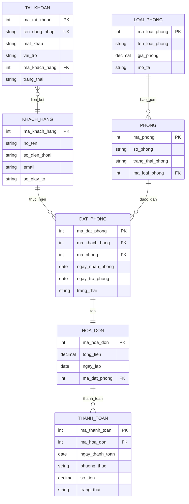

# Three Flower Hotel - Hệ thống Quản lý Khách sạn

Hệ thống web app quản lý khách sạn **Three Flower Hotel** hỗ trợ hai vai trò: **Lễ tân** (quản lý toàn bộ nghiệp vụ khách sạn) và **Khách hàng** (đặt phòng trực tuyến). Người dùng đăng nhập vào cùng một ứng dụng và được phân quyền tự động dựa trên tài khoản.

## Mục lục

- [Tổng quan kiến trúc](#tổng-quan-kiến-trúc)
- [Công nghệ sử dụng](#công-nghệ-sử-dụng)
- [Cấu trúc thư mục](#cấu-trúc-thư-mục)
- [Cơ sở dữ liệu](#cơ-sở-dữ-liệu)
- [Backend API](#backend-api)
- [Frontend](#frontend)
- [Phân quyền vai trò](#phân-quyền-vai-trò)
- [Hướng dẫn cài đặt](#hướng-dẫn-cài-đặt)
- [Hướng dẫn sử dụng](#hướng-dẫn-sử-dụng)
- [Tài liệu thiết kế](#tài-liệu-thiết-kế)

---

## Tổng quan kiến trúc

```
┌─────────────────┐       HTTP/JSON        ┌─────────────────┐       SQL        ┌─────────────┐
│                 │  ◄──────────────────►   │                 │  ◄────────────►  │             │
│  React Frontend │     REST API + JWT      │  FastAPI Backend │    SQLAlchemy    │  MySQL DB   │
│  (port 5173)    │                         │  (port 8000)     │                  │  (port 3307)│
│                 │                         │                 │                  │             │
└─────────────────┘                         └─────────────────┘                  └─────────────┘
```

- **Frontend** gửi request đến Backend qua REST API, kèm JWT token trong header `Authorization`.
- **Backend** xác thực token, kiểm tra vai trò, xử lý nghiệp vụ và truy vấn MySQL.
- **Vite dev server** proxy tất cả request `/api/*` đến `http://localhost:8000` trong môi trường phát triển.

---

## Công nghệ sử dụng

| Thành phần | Công nghệ | Phiên bản |
|------------|-----------|-----------|
| Frontend | React | 19.x |
| Routing | React Router | 7.x |
| CSS | TailwindCSS | 4.x |
| Biểu đồ | Recharts | 3.x |
| HTTP Client | Axios | 1.x |
| Build tool | Vite | 7.x |
| Backend | FastAPI | 0.121.x |
| ORM | SQLAlchemy | 2.x |
| Database | MySQL | 8.x |
| Auth | JWT (python-jose) + bcrypt (passlib) | - |
| Server | Uvicorn | 0.38.x |

---

## Cấu trúc thư mục

```
Three-Flower-Hotel/
├── .env                          # Biến môi trường (DB, JWT secret)
├── requirements.txt              # Python dependencies
├── data/
│   └── Three_Flow_Hotel.sql      # Schema + mock data cho MySQL
├── docs/                         # Tài liệu thiết kế (BFD, DFD, RDM)
│
├── backend/                      # FastAPI Backend
│   ├── main.py                   # Entry point, CORS, router registration
│   ├── database.py               # Kết nối MySQL, init_db()
│   ├── models.py                 # SQLAlchemy ORM models (7 bảng)
│   ├── schemas.py                # Pydantic request/response schemas
│   ├── auth.py                   # JWT, hash password, role guard
│   └── routers/                  # API route modules
│       ├── auth.py               # POST /login, /register, GET /me
│       ├── room_types.py         # CRUD /api/loai-phong
│       ├── rooms.py              # CRUD /api/phong
│       ├── customers.py          # CRUD /api/khach-hang
│       ├── bookings.py           # CRUD /api/dat-phong
│       ├── invoices.py           # CRUD /api/hoa-don
│       ├── payments.py           # CRUD /api/thanh-toan
│       ├── statistics.py         # GET  /api/thong-ke/*
│       └── accounts.py           # CRUD /api/tai-khoan
│
└── frontend/                     # React Frontend
    ├── index.html
    ├── vite.config.js            # Vite + TailwindCSS + API proxy
    └── src/
        ├── main.jsx              # React root
        ├── App.jsx               # Router config (BrowserRouter)
        ├── index.css             # TailwindCSS + custom theme
        ├── api/
        │   └── axios.js          # Axios instance + JWT interceptor
        ├── contexts/
        │   └── AuthContext.jsx    # Auth state (login, register, logout)
        ├── components/
        │   ├── ReceptionistLayout.jsx  # Sidebar layout cho Lễ tân
        │   ├── CustomerLayout.jsx      # Header layout cho Khách hàng
        │   ├── ProtectedRoute.jsx      # Route guard theo vai trò
        │   └── Modal.jsx               # Reusable modal component
        └── pages/
            ├── Login.jsx
            ├── Register.jsx
            ├── receptionist/     # 9 trang quản lý cho Lễ tân
            │   ├── Dashboard.jsx
            │   ├── RoomTypes.jsx
            │   ├── Rooms.jsx
            │   ├── Customers.jsx
            │   ├── Bookings.jsx
            │   ├── Invoices.jsx
            │   ├── Payments.jsx
            │   ├── Statistics.jsx
            │   └── Accounts.jsx
            └── customer/         # 4 trang cho Khách hàng
                ├── Dashboard.jsx
                ├── BrowseRooms.jsx
                ├── MyBookings.jsx
                └── MyInvoices.jsx
```

---

## Cơ sở dữ liệu

### Sơ đồ quan hệ (RDM)



### Mô tả bảng

| Bảng | Tên tiếng Việt | Mô tả |
|------|----------------|-------|
| `TAI_KHOAN` | Tài khoản | Lưu thông tin đăng nhập, vai trò (`le_tan` / `khach_hang`). Tự động tạo khi backend khởi động. |
| `KHACH_HANG` | Khách hàng | Thông tin cá nhân khách hàng (họ tên, SĐT, email, giấy tờ). |
| `LOAI_PHONG` | Loại phòng | Phân loại phòng (tên, giá/đêm, mô tả). |
| `PHONG` | Phòng | Danh sách phòng vật lý (số phòng, loại, trạng thái: Trống/Đã đặt/Đang sử dụng). |
| `DAT_PHONG` | Đặt phòng | Đơn đặt phòng (khách, phòng, ngày nhận/trả, trạng thái: Đang chờ/Đã xác nhận/Đã hủy). |
| `HOA_DON` | Hóa đơn | Hóa đơn gắn với đặt phòng (tổng tiền = giá phòng x số đêm). |
| `THANH_TOAN` | Thanh toán | Giao dịch thanh toán cho hóa đơn (phương thức, số tiền, trạng thái). |

---

## Backend API

### Xác thực (Authentication)

Hệ thống sử dụng **JWT Bearer Token**. Token có thời hạn 8 giờ (480 phút).

| Method | Endpoint | Mô tả | Auth |
|--------|----------|-------|------|
| POST | `/api/auth/register` | Đăng ký tài khoản khách hàng mới | Không |
| POST | `/api/auth/login` | Đăng nhập, nhận JWT token | Không |
| GET | `/api/auth/me` | Xem thông tin tài khoản hiện tại | Token |

### Luồng xác thực

```
1. Người dùng POST /api/auth/login với {ten_dang_nhap, mat_khau}
2. Server xác minh credentials, trả về {access_token, vai_tro, ho_ten}
3. Frontend lưu token vào localStorage
4. Mọi request tiếp theo gửi header: Authorization: Bearer <token>
5. Server decode token → lấy user ID → kiểm tra vai trò → cho phép/từ chối
```

### API Endpoints đầy đủ

| Module | Method | Endpoint | Mô tả | Quyền |
|--------|--------|----------|-------|-------|
| **Loại phòng** | GET | `/api/loai-phong/` | Danh sách loại phòng | Tất cả |
| | GET | `/api/loai-phong/{id}` | Chi tiết loại phòng | Tất cả |
| | POST | `/api/loai-phong/` | Thêm loại phòng | Lễ tân |
| | PUT | `/api/loai-phong/{id}` | Sửa loại phòng | Lễ tân |
| | DELETE | `/api/loai-phong/{id}` | Xóa loại phòng | Lễ tân |
| **Phòng** | GET | `/api/phong/` | Danh sách phòng (kèm tên loại, giá) | Tất cả |
| | POST | `/api/phong/` | Thêm phòng | Lễ tân |
| | PUT | `/api/phong/{id}` | Sửa phòng | Lễ tân |
| | DELETE | `/api/phong/{id}` | Xóa phòng | Lễ tân |
| **Khách hàng** | GET | `/api/khach-hang/` | Danh sách khách hàng | Lễ tân |
| | POST | `/api/khach-hang/` | Thêm khách hàng | Lễ tân |
| | PUT | `/api/khach-hang/{id}` | Sửa khách hàng | Lễ tân |
| | DELETE | `/api/khach-hang/{id}` | Xóa khách hàng | Lễ tân |
| **Đặt phòng** | GET | `/api/dat-phong/` | Danh sách đặt phòng (Lễ tân: tất cả, KH: của mình) | Token |
| | POST | `/api/dat-phong/` | Tạo đặt phòng (kiểm tra phòng trống tự động) | Token |
| | PUT | `/api/dat-phong/{id}` | Cập nhật trạng thái | Lễ tân |
| | DELETE | `/api/dat-phong/{id}` | Hủy đặt phòng | Token |
| **Hóa đơn** | GET | `/api/hoa-don/` | Danh sách hóa đơn (KH: chỉ của mình) | Token |
| | POST | `/api/hoa-don/` | Lập hóa đơn (tự tính tổng tiền) | Lễ tân |
| | PUT | `/api/hoa-don/{id}` | Sửa hóa đơn | Lễ tân |
| | DELETE | `/api/hoa-don/{id}` | Xóa hóa đơn | Lễ tân |
| **Thanh toán** | GET | `/api/thanh-toan/` | Danh sách thanh toán | Lễ tân |
| | POST | `/api/thanh-toan/` | Tạo thanh toán | Lễ tân |
| | PUT | `/api/thanh-toan/{id}` | Sửa thanh toán | Lễ tân |
| | DELETE | `/api/thanh-toan/{id}` | Xóa thanh toán | Lễ tân |
| **Thống kê** | GET | `/api/thong-ke/tong-quan` | Tổng phòng, phòng trống, đặt phòng, doanh thu | Lễ tân |
| | GET | `/api/thong-ke/dat-phong?nam=2025` | Thống kê đặt phòng theo tháng/năm | Lễ tân |
| **Tài khoản** | GET | `/api/tai-khoan/` | Danh sách tài khoản | Lễ tân |
| | POST | `/api/tai-khoan/` | Tạo tài khoản (lễ tân/khách hàng) | Lễ tân |
| | PUT | `/api/tai-khoan/{id}` | Sửa vai trò/trạng thái | Lễ tân |
| | DELETE | `/api/tai-khoan/{id}` | Xóa tài khoản | Lễ tân |

### Nghiệp vụ tự động

- **Đặt phòng**: Khi tạo đơn, hệ thống kiểm tra xung đột thời gian. Nếu phòng đã được đặt trong khoảng ngày đó thì từ chối. Trạng thái phòng tự động chuyển sang "Đã đặt".
- **Hủy đặt phòng**: Trạng thái phòng tự động chuyển về "Trống" nếu không còn đơn đặt phòng nào active.
- **Lập hóa đơn**: Tổng tiền = giá phòng/đêm x số đêm lưu trú (tự động tính).

---

## Frontend

### Trang đăng nhập & đăng ký

- **Đăng nhập** (`/login`): Nhập tên đăng nhập + mật khẩu. Sau khi đăng nhập, hệ thống tự redirect đến dashboard tương ứng với vai trò.
- **Đăng ký** (`/register`): Dành cho khách hàng mới. Tự động tạo cả bản ghi `KHACH_HANG` và `TAI_KHOAN`.

### Giao diện Lễ tân (`/le-tan/*`)

Layout sidebar bên trái với 9 mục điều hướng:

| Trang | Route | Mô tả |
|-------|-------|-------|
| Tổng quan | `/le-tan` | Dashboard với 4 thẻ thống kê (tổng phòng, phòng trống, đặt phòng, doanh thu) + bảng đặt phòng gần đây |
| Loại phòng | `/le-tan/loai-phong` | Bảng danh sách + modal thêm/sửa |
| Phòng | `/le-tan/phong` | Bảng danh sách phòng với trạng thái badge màu + modal thêm/sửa |
| Khách hàng | `/le-tan/khach-hang` | Bảng CRUD khách hàng |
| Đặt phòng | `/le-tan/dat-phong` | Bảng đặt phòng với chọn khách hàng/phòng + cập nhật trạng thái |
| Hóa đơn | `/le-tan/hoa-don` | Lập hóa đơn từ đặt phòng (tự tính tiền) + sửa/xóa |
| Thanh toán | `/le-tan/thanh-toan` | Ghi nhận thanh toán theo hóa đơn (tiền mặt/chuyển khoản/thẻ) |
| Thống kê | `/le-tan/thong-ke` | Biểu đồ cột (Recharts) số lượng đặt phòng + doanh thu theo tháng, lọc theo năm |
| Tài khoản | `/le-tan/tai-khoan` | Quản lý tài khoản người dùng (tạo/sửa vai trò/vô hiệu hóa/xóa) |

### Giao diện Khách hàng (`/khach-hang/*`)

Layout header ngang phía trên:

| Trang | Route | Mô tả |
|-------|-------|-------|
| Trang chủ | `/khach-hang` | Chào mừng + 3 thẻ nhanh (tìm phòng, đặt phòng, hóa đơn) + đặt phòng gần đây |
| Tìm phòng | `/khach-hang/tim-phong` | Grid card hiển thị tất cả phòng, lọc theo trạng thái, nút "Đặt phòng ngay" cho phòng trống |
| Đặt phòng của tôi | `/khach-hang/dat-phong` | Danh sách đặt phòng của mình + nút hủy |
| Hóa đơn của tôi | `/khach-hang/hoa-don` | Danh sách hóa đơn liên quan đến đặt phòng của mình |

---

## Phân quyền vai trò

```
                    ┌──────────────────────────────┐
                    │         Đăng nhập             │
                    └──────────┬───────────────────┘
                               │
                    ┌──────────▼───────────────────┐
                    │    Kiểm tra vai_tro           │
                    └──────────┬───────────────────┘
                               │
              ┌────────────────┴────────────────┐
              │                                 │
    ┌─────────▼──────────┐           ┌──────────▼──────────┐
    │   vai_tro = le_tan │           │ vai_tro = khach_hang │
    │                    │           │                      │
    │  → /le-tan/*       │           │  → /khach-hang/*     │
    │  Full CRUD tất cả  │           │  Xem phòng, đặt     │
    │  module + thống kê │           │  phòng, xem hóa đơn │
    └────────────────────┘           └──────────────────────┘
```

| Hành động | Lễ tân | Khách hàng |
|-----------|:------:|:----------:|
| Xem danh sách phòng/loại phòng | V | V |
| Thêm/sửa/xóa phòng, loại phòng | V | - |
| Xem tất cả khách hàng | V | - |
| Thêm/sửa/xóa khách hàng | V | - |
| Tạo đặt phòng | V | V (cho bản thân) |
| Xem tất cả đặt phòng | V | - (chỉ của mình) |
| Cập nhật trạng thái đặt phòng | V | - |
| Hủy đặt phòng | V | V (chỉ của mình) |
| Lập/sửa/xóa hóa đơn | V | - |
| Xem hóa đơn | V | V (chỉ của mình) |
| Tạo/sửa/xóa thanh toán | V | - |
| Xem thống kê | V | - |
| Quản lý tài khoản | V | - |

---

## Hướng dẫn cài đặt

### Yêu cầu hệ thống

- **Python** >= 3.10
- **Node.js** >= 18
- **MySQL** >= 8.0 (đang chạy trên port 3307)

### 1. Clone repository

```bash
git clone <repository-url>
cd Three-Flower-Hotel
```

### 2. Cấu hình cơ sở dữ liệu

Tạo database MySQL và import schema + mock data:

```bash
mysql -u root -p --port=3307 < data/Three_Flow_Hotel.sql
```

Tạo file `.env` ở thư mục gốc:

```env
DB_USER=root
DB_PASS=<mật_khẩu_mysql>
DB_HOST=localhost
DB_PORT=3307
DB_NAME=hotel_bahoa
SECRET_KEY=<chuỗi_bí_mật_bất_kỳ>
ALGORITHM=HS256
ACCESS_TOKEN_EXPIRE_MINUTES=480
```

### 3. Cài đặt Backend

```bash
# Tạo virtual environment (khuyến nghị)
python -m venv .venv
source .venv/bin/activate        # macOS/Linux
# .venv\Scripts\activate         # Windows

# Cài đặt dependencies
pip install -r requirements.txt
```

### 4. Cài đặt Frontend

```bash
cd frontend
npm install
```

### 5. Tạo tài khoản Lễ tân mặc định

```bash
# Từ thư mục gốc project
python -c "
from backend.database import SessionLocal
from backend.models import TaiKhoan
from backend.auth import hash_password
db = SessionLocal()
if not db.query(TaiKhoan).filter(TaiKhoan.ten_dang_nhap == 'letan').first():
    db.add(TaiKhoan(ten_dang_nhap='letan', mat_khau=hash_password('letan123'), vai_tro='le_tan'))
    db.commit()
    print('Tạo tài khoản lễ tân thành công')
else:
    print('Tài khoản đã tồn tại')
db.close()
"
```

### 6. Khởi chạy hệ thống

Mở **hai terminal**:

**Terminal 1 - Backend** (từ thư mục gốc):

```bash
python -m uvicorn backend.main:app --reload --port 8000
```

**Terminal 2 - Frontend** (từ thư mục `frontend`):

```bash
cd frontend
npm run dev
```

### 7. Truy cập ứng dụng

Mở trình duyệt và truy cập: **http://localhost:5173**

---

## Hướng dẫn sử dụng

### Đăng nhập với tài khoản Lễ tân

| Trường | Giá trị |
|--------|---------|
| Tên đăng nhập | `letan` |
| Mật khẩu | `letan123` |

Sau khi đăng nhập, bạn sẽ được chuyển đến dashboard Lễ tân (`/le-tan`) với sidebar điều hướng.

### Đăng ký tài khoản Khách hàng

1. Tại trang đăng nhập, nhấn **"Đăng ký ngay"**.
2. Điền thông tin: họ tên, tên đăng nhập, mật khẩu, SĐT, email, số giấy tờ.
3. Nhấn **"Đăng ký"** - hệ thống tự tạo tài khoản và đăng nhập.

### Quy trình nghiệp vụ mẫu

#### A. Lễ tân xử lý đặt phòng

```
1. Đăng nhập với tài khoản lễ tân
2. Kiểm tra danh sách phòng trống tại menu "Phòng"
3. Vào menu "Đặt phòng" → nhấn "Tạo đặt phòng"
4. Chọn khách hàng, chọn phòng trống, nhập ngày nhận/trả phòng
5. Xác nhận đặt phòng → trạng thái phòng tự động chuyển "Đã đặt"
6. Vào menu "Hóa đơn" → nhấn "Lập hóa đơn" → chọn đặt phòng
   (tổng tiền = giá phòng × số đêm, tự động tính)
7. Vào menu "Thanh toán" → nhấn "Thêm thanh toán"
   → chọn hóa đơn, phương thức, nhập số tiền
```

#### B. Khách hàng đặt phòng online

```
1. Đăng ký tài khoản hoặc đăng nhập
2. Vào menu "Tìm phòng" → xem danh sách phòng dạng card
3. Lọc phòng trống → nhấn "Đặt phòng ngay" trên phòng muốn đặt
4. Chọn ngày nhận phòng và ngày trả phòng → "Xác nhận đặt"
5. Xem trạng thái đặt phòng tại "Đặt phòng của tôi"
6. Có thể hủy đặt phòng nếu trạng thái chưa hoàn tất
7. Xem hóa đơn tại "Hóa đơn của tôi" (sau khi lễ tân lập)
```

### Swagger API Docs

Khi backend đang chạy, truy cập tài liệu API tự động tại:

- **Swagger UI**: http://localhost:8000/docs
- **ReDoc**: http://localhost:8000/redoc

---

## Tài liệu thiết kế

Tài liệu thiết kế chi tiết nằm trong thư mục `docs/`:

- `Hotel_System_Describe.md` - Mô tả chi tiết hệ thống, DFD mức 0/1/2, RDM
- `Hotel Services Catalog Flow-*.png` - Sơ đồ BFD
- `Hotel-DFD 0.png` - DFD mức 0
- `Hotel-DFD 1.png` - DFD mức 1
- `Hotel-DFD mức 2 (*.png)` - DFD mức 2 cho từng module

---

## License

[MIT](LICENSE)
