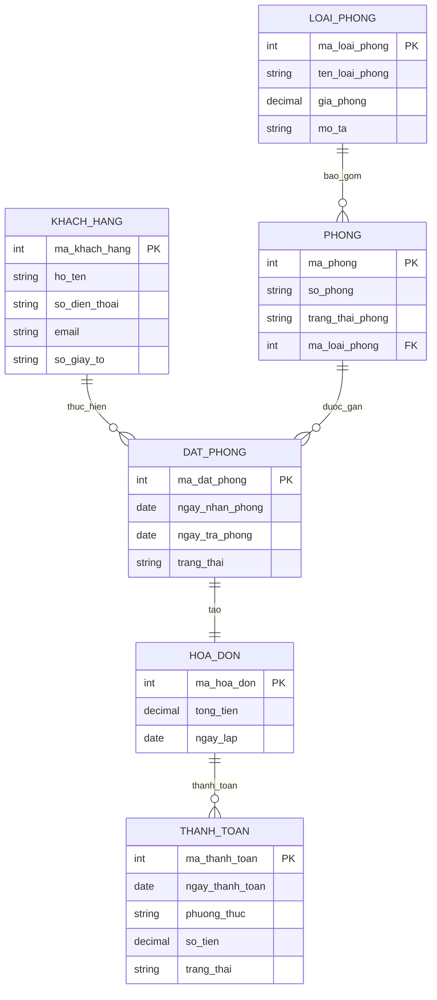

# **Mô tả hệ thống Hotel Management System**

Hệ thống Quản lý Khách sạn (Hotel Management System) được xây dựng nhằm hỗ trợ khách sạn trong việc quản lý tập trung các nghiệp vụ cốt lõi như: phòng, loại phòng, đặt phòng, hóa đơn, tài khoản người dùng và thống kê.

Hệ thống phục vụ chủ yếu cho **nhân viên khách sạn** (lễ tân, quản lý), giúp giảm thao tác thủ công, đảm bảo dữ liệu nhất quán và hỗ trợ ra quyết định.

## **1\. Quản lý Phòng**

Chức năng này cho phép quản lý danh sách các phòng hiện có trong khách sạn.

Các nghiệp vụ bao gồm:

- **Thêm phòng**: nhập thông tin phòng mới (mã phòng, loại phòng, trạng thái, mô tả,…).

- **Xem danh sách phòng**: hiển thị toàn bộ phòng trong hệ thống.

- **Cập nhật phòng**: chỉnh sửa thông tin phòng (trạng thái, loại phòng,…).

- **Xóa phòng**: loại bỏ phòng không còn sử dụng khỏi hệ thống.

## **2\. Quản lý Loại phòng**

Chức năng này dùng để quản lý các loại phòng mà khách sạn cung cấp.

Các nghiệp vụ bao gồm:

- **Thêm loại phòng**: khai báo loại phòng mới (tên loại, giá, mô tả,…).

- **Xem loại phòng**: xem danh sách các loại phòng.

- **Cập nhật loại phòng**: chỉnh sửa thông tin loại phòng.

- **Xóa loại phòng**: xóa loại phòng không còn áp dụng.

Loại phòng là cơ sở để phân loại và quản lý phòng trong hệ thống.

## **3\. Quản lý Đặt phòng**

Chức năng này hỗ trợ quản lý toàn bộ quá trình đặt phòng của khách hàng.

Các nghiệp vụ bao gồm:

- **Thêm đặt phòng**: tạo mới một đơn đặt phòng cho khách hàng (thông tin khách, thời gian lưu trú, phòng/loại phòng).

- **Xem đặt phòng**: tra cứu danh sách và chi tiết các đơn đặt phòng.

- **Cập nhật đặt phòng**: chỉnh sửa thông tin đặt phòng khi có thay đổi.

- **Hủy / Xóa đặt phòng**: hủy hoặc xóa đơn đặt phòng khi không còn hiệu lực.

## **4\. Quản lý Hóa đơn**

Chức năng này dùng để quản lý các hóa đơn phát sinh trong quá trình khách lưu trú.

Các nghiệp vụ bao gồm:

- **Lập hóa đơn**: tạo hóa đơn cho khách hàng dựa trên đặt phòng và dịch vụ sử dụng.

- **Xem hóa đơn**: tra cứu thông tin hóa đơn.

- **Cập nhật hóa đơn**: điều chỉnh thông tin hóa đơn khi cần.

- **Xóa hóa đơn**: xóa hóa đơn không hợp lệ hoặc bị hủy.

## **5\. Quản lý Tài khoản**

Chức năng này hỗ trợ quản lý tài khoản người dùng trong hệ thống.

Các nghiệp vụ bao gồm:

- **Thêm tài khoản**: tạo tài khoản mới cho nhân viên hoặc quản lý.

- **Xem tài khoản**: xem danh sách tài khoản.

- **Cập nhật tài khoản**: chỉnh sửa thông tin tài khoản.

- **Xóa tài khoản**: xóa tài khoản không còn sử dụng.

## **6\. Thống kê**

Chức năng thống kê giúp hỗ trợ quản lý và theo dõi hoạt động của khách sạn.

Các nghiệp vụ bao gồm:

- **Thống kê số lượng đặt phòng**: tổng hợp số lượng đơn đặt phòng theo thời gian.

## **Sơ đồ BFD**

## **Tổng kết**

Hệ thống được thiết kế theo mô hình **chức năng \- CRUD**, mỗi phân hệ đảm nhiệm một nghiệp vụ riêng biệt nhưng liên kết chặt chẽ với nhau.

Cấu trúc này giúp:

- Dễ triển khai trong phạm vi đồ án

- Dễ mở rộng trong tương lai

- Phù hợp với BFD và DFD của hệ thống

# Sơ đồ RDM - Relational Data model

# System Overview và Sơ đồ DFD - Data flow diagram

## System Name

Hotel Management System

## External Entities

- Customer
- Receptionist
- Manager (for reporting)

## Data Stores (Derived from RDM)

ID Name Based on Table

---

D1 LOAI_PHONG Room Type
D2 PHONG Room
D3 KHACH_HANG Customer
D4 DAT_PHONG Booking
D5 HOA_DON Invoice
D6 THANH_TOAN Payment

## Mức 0

## Mức 1

## Mức 2

### Module: Room Type Management (Quản lý loại phòng)

.png>)

#### Processes

- 1.1 Create Room Type
- 1.2 View Room Types
- 1.3 Update Room Type
- 1.4 Delete Room Type

#### 1.1 Create Room Type

##### Input (From Receptionist)

- ten_loai_phong
- gia_phong
- mo_ta

##### Processing Logic

- Validate required fields
- Generate ma_loai_phong
- Insert into LOAI_PHONG

##### Output (To D1)

- ma_loai_phong
- ten_loai_phong
- gia_phong
- mo_ta

---

#### 1.2 View Room Types

##### Input

- request_room_type_list

##### Processing Logic

- Query all records from LOAI_PHONG

##### Output

- List of room types

---

### Module: Room Management (Quản lý phòng)

.png>)

#### Processes

- 2.1 Create Room
- 2.2 View Rooms
- 2.3 Update Room
- 2.4 Delete Room

#### 2.1 Create Room

##### Input

- so_phong
- ma_loai_phong
- trang_thai_phong

##### Processing Logic

- Validate ma_loai_phong exists
- Insert into PHONG

##### Output (To D2)

- ma_phong
- so_phong
- ma_loai_phong
- trang_thai_phong

---

### Module: Customer Account Management (Quản lý tài khoản)

.png>)

#### Processes

- 3.1 Create Customer
- 3.2 View Customer
- 3.3 Update Customer
- 3.4 Delete Customer

#### 3.1 Create Customer

##### Input

- ho_ten
- so_dien_thoai
- email
- so_giay_to

##### Processing Logic

- Validate uniqueness
- Insert into KHACH_HANG

##### Output

- ma_khach_hang
- ho_ten
- so_dien_thoai
- email
- so_giay_to

---

### Module: Booking Management (Quản lý đặt phòng)

.png>)

#### Processes

- 4.1 Create Booking
- 4.2 View Booking
- 4.3 Update Booking
- 4.4 Cancel Booking

#### 4.1 Create Booking

##### Input

- ma_khach_hang
- ma_phong
- ngay_nhan_phong
- ngay_tra_phong

##### Processing Logic

1.  Validate customer exists
2.  Validate room exists
3.  Check availability
4.  Insert into DAT_PHONG
5.  Update PHONG.trang_thai_phong

##### Output

- ma_dat_phong
- ma_khach_hang
- ma_phong
- ngay_nhan_phong
- ngay_tra_phong
- trang_thai

---

### Module: Invoice & Payment Management (Quản lý hoá đơn)

.png>)

#### Processes

- 5.1 Create Invoice
- 5.2 View Invoice
- 5.3 Update Invoice
- 5.4 Delete Invoice

#### 5.1 Create Invoice

##### Input

- ma_dat_phong

##### Processing Logic

1.  Retrieve booking info
2.  Calculate total
3.  Insert into HOA_DON

##### Output

- ma_hoa_don
- ma_dat_phong
- tong_tien
- ngay_lap

#### Payment Recording

##### Input

- ma_hoa_don
- ngay_thanh_toan
- phuong_thuc
- so_tien

##### Processing Logic

- Insert into THANH_TOAN
- Update invoice status

##### Output

- ma_thanh_toan
- ma_hoa_don
- ngay_thanh_toan
- phuong_thuc
- so_tien
- trang_thai

---

### Module: Reporting (Thống kê số lượng đặt phòng)

.png>)

#### Process

- 6.1 Booking Statistics

##### Input

- report_period

##### Processing Logic

- Aggregate from DAT_PHONG

##### Output

- Total bookings
- Total revenue
- Occupancy rate

# Data Flow Integrity Rules

1.  External entities never access data stores directly.
2.  All data flows through processes.
3.  Every process must have at least one input and one output.
4.  All data elements must exist in RDM.
