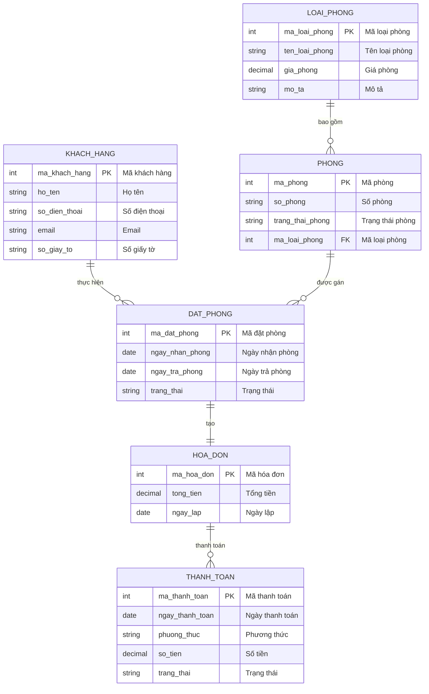
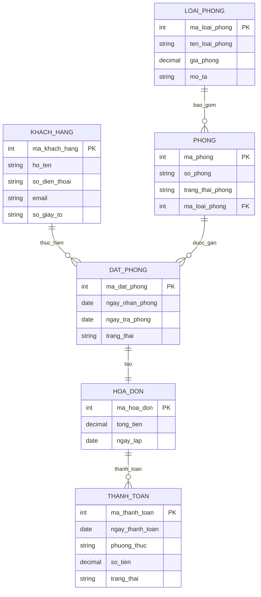
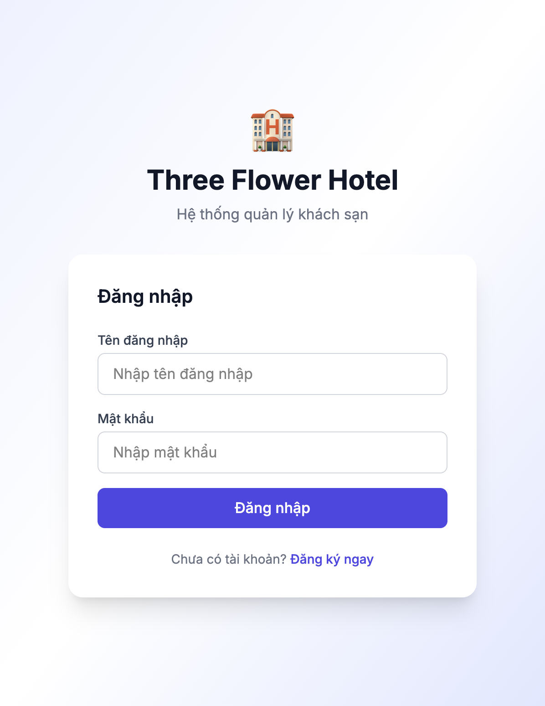
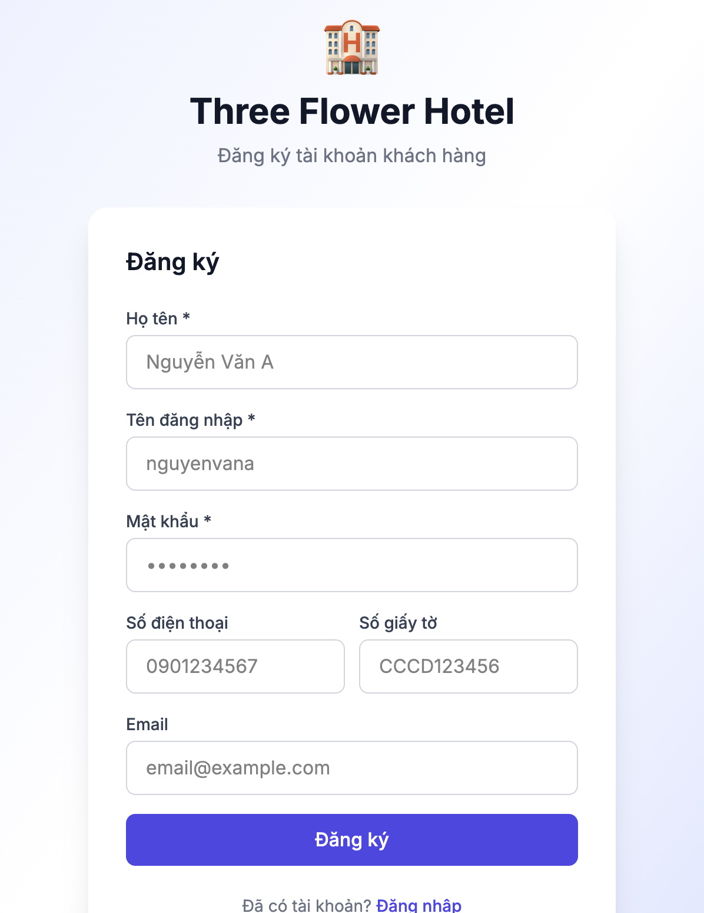
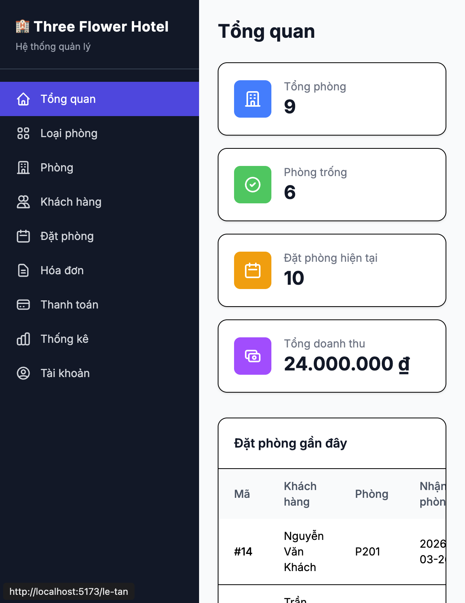

# **Mô tả hệ thống Hotel Management System**

Hệ thống Quản lý Khách sạn (Hotel Management System) được xây dựng nhằm hỗ trợ khách sạn trong việc quản lý tập trung các nghiệp vụ cốt lõi như: phòng, loại phòng, đặt phòng, hóa đơn, tài khoản người dùng và thống kê.

Hệ thống phục vụ chủ yếu cho **nhân viên khách sạn** (lễ tân, quản lý), giúp giảm thao tác thủ công, đảm bảo dữ liệu nhất quán và hỗ trợ ra quyết định.

## **1\. Quản lý Phòng**

Chức năng này cho phép quản lý danh sách các phòng hiện có trong khách sạn.

Các nghiệp vụ bao gồm:

- **Thêm phòng**: nhập thông tin phòng mới (mã phòng, loại phòng, trạng thái, mô tả,…).

- **Xem danh sách phòng**: hiển thị toàn bộ phòng trong hệ thống.

- **Cập nhật phòng**: chỉnh sửa thông tin phòng (trạng thái, loại phòng,…).

- **Xóa phòng**: loại bỏ phòng không còn sử dụng khỏi hệ thống.

## **2\. Quản lý Loại phòng**

Chức năng này dùng để quản lý các loại phòng mà khách sạn cung cấp.

Các nghiệp vụ bao gồm:

- **Thêm loại phòng**: khai báo loại phòng mới (tên loại, giá, mô tả,…).

- **Xem loại phòng**: xem danh sách các loại phòng.

- **Cập nhật loại phòng**: chỉnh sửa thông tin loại phòng.

- **Xóa loại phòng**: xóa loại phòng không còn áp dụng.

Loại phòng là cơ sở để phân loại và quản lý phòng trong hệ thống.

## **3\. Quản lý Đặt phòng**

Chức năng này hỗ trợ quản lý toàn bộ quá trình đặt phòng của khách hàng.

Các nghiệp vụ bao gồm:

- **Thêm đặt phòng**: tạo mới một đơn đặt phòng cho khách hàng (thông tin khách, thời gian lưu trú, phòng/loại phòng).

- **Xem đặt phòng**: tra cứu danh sách và chi tiết các đơn đặt phòng.

- **Cập nhật đặt phòng**: chỉnh sửa thông tin đặt phòng khi có thay đổi.

- **Hủy / Xóa đặt phòng**: hủy hoặc xóa đơn đặt phòng khi không còn hiệu lực.

## **4\. Quản lý Hóa đơn**

Chức năng này dùng để quản lý các hóa đơn phát sinh trong quá trình khách lưu trú.

Các nghiệp vụ bao gồm:

- **Lập hóa đơn**: tạo hóa đơn cho khách hàng dựa trên đặt phòng và dịch vụ sử dụng.

- **Xem hóa đơn**: tra cứu thông tin hóa đơn.

- **Cập nhật hóa đơn**: điều chỉnh thông tin hóa đơn khi cần.

- **Xóa hóa đơn**: xóa hóa đơn không hợp lệ hoặc bị hủy.

## **5\. Quản lý Tài khoản**

Chức năng này hỗ trợ quản lý tài khoản người dùng trong hệ thống.

Các nghiệp vụ bao gồm:

- **Thêm tài khoản**: tạo tài khoản mới cho nhân viên hoặc quản lý.

- **Xem tài khoản**: xem danh sách tài khoản.

- **Cập nhật tài khoản**: chỉnh sửa thông tin tài khoản.

- **Xóa tài khoản**: xóa tài khoản không còn sử dụng.

## **6\. Thống kê**

Chức năng thống kê giúp hỗ trợ quản lý và theo dõi hoạt động của khách sạn.

Các nghiệp vụ bao gồm:

- **Thống kê số lượng đặt phòng**: tổng hợp số lượng đơn đặt phòng theo thời gian.

## **Sơ đồ BFD**

## **Tổng kết**

Hệ thống được thiết kế theo mô hình **chức năng \- CRUD**, mỗi phân hệ đảm nhiệm một nghiệp vụ riêng biệt nhưng liên kết chặt chẽ với nhau.

Cấu trúc này giúp:

- Dễ triển khai trong phạm vi đồ án

- Dễ mở rộng trong tương lai

- Phù hợp với BFD và DFD của hệ thống

# Sơ đồ ERD - Entity Relational Data model

**ERD chuẩn (ký hiệu Chen):** Sơ đồ trên dùng ký hiệu dạng bảng (crows-foot). Để xem ERD theo ký hiệu Chen (thực thể = hình chữ nhật, quan hệ = hình thoi, thuộc tính trong thực thể, bản số (min,max)): mở file [docs/ERD_Hotel_Chen_Style.html](ERD_Hotel_Chen_Style.html) trong trình duyệt. Có thể vẽ lại trên [ERDPlus Trial](https://erdplus.com/trial) theo đúng sơ đồ đó (Entity → Attribute → Relationship → đặt bản số).

# Sơ đồ RDM - Relational Data model

## Danh sách bảng và mô tả tổng quan

Mô hình dữ liệu quan hệ (RDM) của hệ thống Hotel Management System gồm **6 bảng** chính, phản ánh các thực thể nghiệp vụ và quan hệ giữa chúng:

| STT | Tên bảng (tiếng Việt) | Tên bảng (DB) | Mô tả ngắn                                                      |
| --- | --------------------- | ------------- | --------------------------------------------------------------- |
| 1   | Khách hàng            | KHACH_HANG    | Lưu thông tin khách hàng sử dụng dịch vụ đặt phòng.             |
| 2   | Loại phòng            | LOAI_PHONG    | Định nghĩa các loại phòng (tiêu chuẩn, VIP, …) và giá.          |
| 3   | Phòng                 | PHONG         | Danh sách phòng vật lý, thuộc một loại phòng, có trạng thái.    |
| 4   | Đặt phòng             | DAT_PHONG     | Ghi nhận đơn đặt phòng (khách, thời gian nhận/trả, trạng thái). |
| 5   | Hóa đơn               | HOA_DON       | Hóa đơn tổng hợp cho mỗi đơn đặt phòng (tổng tiền, ngày lập).   |
| 6   | Thanh toán            | THANH_TOAN    | Các lần thanh toán (một phần hoặc toàn bộ) cho một hóa đơn.     |

Quan hệ chính: **KHACH_HANG** thực hiện **DAT_PHONG**; **DAT_PHONG** gắn với **PHONG** (thuộc **LOAI_PHONG**); mỗi **DAT_PHONG** tạo ra đúng một **HOA_DON**; **HOA_DON** có thể có nhiều **THANH_TOAN**.

## Mô tả chi tiết từng bảng RDM

### 1. Bảng KHACH_HANG (Khách hàng)

Lưu trữ thông tin cá nhân của khách hàng khi sử dụng dịch vụ đặt phòng của khách sạn.

| Thuộc tính    | Kiểu    | Mô tả                                                                         |
| ------------- | ------- | ----------------------------------------------------------------------------- |
| ma_khach_hang | int, PK | Mã định danh duy nhất của khách hàng.                                         |
| ho_ten        | string  | Họ và tên đầy đủ của khách hàng.                                              |
| so_dien_thoai | string  | Số điện thoại liên hệ.                                                        |
| email         | string  | Địa chỉ email.                                                                |
| so_giay_to    | string  | Số giấy tờ tùy thân (CMND/CCCD, hộ chiếu,…) dùng để đối chiếu khi nhận phòng. |

**Ghi chú:** Một khách hàng có thể thực hiện nhiều đơn đặt phòng (quan hệ 1–n với DAT_PHONG).

---

### 2. Bảng LOAI_PHONG (Loại phòng)

Định nghĩa các loại phòng mà khách sạn cung cấp (ví dụ: phòng đơn, đôi, VIP, suite), kèm giá và mô tả.

| Thuộc tính     | Kiểu    | Mô tả                                                                  |
| -------------- | ------- | ---------------------------------------------------------------------- |
| ma_loai_phong  | int, PK | Mã định danh duy nhất của loại phòng.                                  |
| ten_loai_phong | string  | Tên loại phòng (hiển thị cho khách và nhân viên).                      |
| gia_phong      | decimal | Đơn giá phòng (theo đơn vị tính: ngày/đêm hoặc theo quy ước hệ thống). |
| mo_ta          | string  | Mô tả chi tiết (diện tích, tiện nghi, …).                              |

**Ghi chú:** Một loại phòng bao gồm nhiều phòng cụ thể (quan hệ 1–n với PHONG).

---

### 3. Bảng PHONG (Phòng)

Danh sách các phòng vật lý trong khách sạn; mỗi phòng thuộc một loại phòng và có trạng thái (trống, đã đặt, đang sử dụng, bảo trì,…).

| Thuộc tính       | Kiểu    | Mô tả                                                        |
| ---------------- | ------- | ------------------------------------------------------------ |
| ma_phong         | int, PK | Mã định danh duy nhất của phòng.                             |
| so_phong         | string  | Số phòng hiển thị (ví dụ: "101", "A201").                    |
| trang_thai_phong | string  | Trạng thái hiện tại: trống, đã đặt, đang sử dụng, bảo trì, … |
| ma_loai_phong    | int, FK | Khóa ngoại tham chiếu đến LOAI_PHONG.                        |

**Ghi chú:** Một phòng có thể được gán cho nhiều đơn đặt phòng ở các khoảng thời gian khác nhau (quan hệ n–n với DAT_PHONG qua việc gán phòng theo kỳ).

---

### 4. Bảng DAT_PHONG (Đặt phòng)

Ghi nhận từng đơn đặt phòng: khách hàng nào, thời gian nhận phòng – trả phòng, trạng thái đặt phòng (chờ xác nhận, đã xác nhận, đã nhận phòng, đã trả phòng, đã hủy,…).

| Thuộc tính      | Kiểu    | Mô tả                                                                             |
| --------------- | ------- | --------------------------------------------------------------------------------- |
| ma_dat_phong    | int, PK | Mã định danh duy nhất của đơn đặt phòng.                                          |
| ngay_nhan_phong | date    | Ngày (và có thể giờ) nhận phòng dự kiến/thực tế.                                  |
| ngay_tra_phong  | date    | Ngày (và có thể giờ) trả phòng dự kiến/thực tế.                                   |
| trang_thai      | string  | Trạng thái đơn: chờ xác nhận, đã xác nhận, đã nhận phòng, đã trả phòng, đã hủy, … |

**Ghi chú:** Trong mô hình có thể bổ sung khóa ngoại ma_khach_hang (→ KHACH_HANG), ma_phong (→ PHONG) tùy thiết kế chi tiết. Mỗi đơn đặt phòng tạo ra đúng một hóa đơn (quan hệ 1–1 với HOA_DON).

---

### 5. Bảng HOA_DON (Hóa đơn)

Hóa đơn tổng hợp cho một đơn đặt phòng: tổng tiền phải thanh toán và ngày lập.

| Thuộc tính | Kiểu    | Mô tả                                                        |
| ---------- | ------- | ------------------------------------------------------------ |
| ma_hoa_don | int, PK | Mã định danh duy nhất của hóa đơn.                           |
| tong_tien  | decimal | Tổng số tiền của hóa đơn (phòng + dịch vụ phát sinh nếu có). |
| ngay_lap   | date    | Ngày lập hóa đơn.                                            |

**Ghi chú:** Một hóa đơn có thể được thanh toán nhiều lần (trả góp, trả trước/trả sau) nên có quan hệ 1–n với THANH_TOAN.

---

### 6. Bảng THANH_TOAN (Thanh toán)

Ghi nhận từng lần thanh toán (một phần hoặc toàn bộ) cho một hóa đơn: ngày, phương thức, số tiền, trạng thái.

| Thuộc tính      | Kiểu    | Mô tả                                                                |
| --------------- | ------- | -------------------------------------------------------------------- |
| ma_thanh_toan   | int, PK | Mã định danh duy nhất của giao dịch thanh toán.                      |
| ngay_thanh_toan | date    | Ngày (và có thể giờ) thanh toán.                                     |
| phuong_thuc     | string  | Phương thức: tiền mặt, chuyển khoản, thẻ, ví điện tử, …              |
| so_tien         | decimal | Số tiền thanh toán trong lần này.                                    |
| trang_thai      | string  | Trạng thái giao dịch: thành công, thất bại, đang xử lý, hoàn tiền, … |

**Ghi chú:** Trong thiết kế đầy đủ cần có khóa ngoại ma_hoa_don tham chiếu đến HOA_DON. Tổng các lần thanh toán thành công có thể so sánh với tong_tien trong HOA_DON để xác định đã thanh toán đủ hay chưa.

---

# System Overview và Sơ đồ DFD - Data flow diagram

## System Name

Hotel Management System

## External Entities

- Customer
- Receptionist
- Manager (for reporting)

## Data Stores (Derived from RDM)

ID Name Based on Table

---

D1 LOAI_PHONG Room Type
D2 PHONG Room
D3 KHACH_HANG Customer
D4 DAT_PHONG Booking
D5 HOA_DON Invoice
D6 THANH_TOAN Payment

## Mức 0

## Mức 1

## Mức 2

### Module: Room Type Management (Quản lý loại phòng)

.png>)

#### Processes

- 1.1 Create Room Type
- 1.2 View Room Types
- 1.3 Update Room Type
- 1.4 Delete Room Type

#### 1.1 Create Room Type

##### Input (From Receptionist)

- ten_loai_phong
- gia_phong
- mo_ta

##### Processing Logic

- Validate required fields
- Generate ma_loai_phong
- Insert into LOAI_PHONG

##### Output (To D1)

- ma_loai_phong
- ten_loai_phong
- gia_phong
- mo_ta

---

#### 1.2 View Room Types

##### Input

- request_room_type_list

##### Processing Logic

- Query all records from LOAI_PHONG

##### Output

- List of room types

---

### Module: Room Management (Quản lý phòng)

.png>)

#### Processes

- 2.1 Create Room
- 2.2 View Rooms
- 2.3 Update Room
- 2.4 Delete Room

#### 2.1 Create Room

##### Input

- so_phong
- ma_loai_phong
- trang_thai_phong

##### Processing Logic

- Validate ma_loai_phong exists
- Insert into PHONG

##### Output (To D2)

- ma_phong
- so_phong
- ma_loai_phong
- trang_thai_phong

---

### Module: Customer Account Management (Quản lý tài khoản)

.png>)

#### Processes

- 3.1 Create Customer
- 3.2 View Customer
- 3.3 Update Customer
- 3.4 Delete Customer

#### 3.1 Create Customer

##### Input

- ho_ten
- so_dien_thoai
- email
- so_giay_to

##### Processing Logic

- Validate uniqueness
- Insert into KHACH_HANG

##### Output

- ma_khach_hang
- ho_ten
- so_dien_thoai
- email
- so_giay_to

---

### Module: Booking Management (Quản lý đặt phòng)

.png>)

#### Processes

- 4.1 Create Booking
- 4.2 View Booking
- 4.3 Update Booking
- 4.4 Cancel Booking

#### 4.1 Create Booking

##### Input

- ma_khach_hang
- ma_phong
- ngay_nhan_phong
- ngay_tra_phong

##### Processing Logic

1.  Validate customer exists
2.  Validate room exists
3.  Check availability
4.  Insert into DAT_PHONG
5.  Update PHONG.trang_thai_phong

##### Output

- ma_dat_phong
- ma_khach_hang
- ma_phong
- ngay_nhan_phong
- ngay_tra_phong
- trang_thai

---

### Module: Invoice & Payment Management (Quản lý hoá đơn)

.png>)

#### Processes

- 5.1 Create Invoice
- 5.2 View Invoice
- 5.3 Update Invoice
- 5.4 Delete Invoice

#### 5.1 Create Invoice

##### Input

- ma_dat_phong

##### Processing Logic

1.  Retrieve booking info
2.  Calculate total
3.  Insert into HOA_DON

##### Output

- ma_hoa_don
- ma_dat_phong
- tong_tien
- ngay_lap

#### Payment Recording

##### Input

- ma_hoa_don
- ngay_thanh_toan
- phuong_thuc
- so_tien

##### Processing Logic

- Insert into THANH_TOAN
- Update invoice status

##### Output

- ma_thanh_toan
- ma_hoa_don
- ngay_thanh_toan
- phuong_thuc
- so_tien
- trang_thai

---

### Module: Reporting (Thống kê số lượng đặt phòng)

.png>)

#### Process

- 6.1 Booking Statistics

##### Input

- report_period

##### Processing Logic

- Aggregate from DAT_PHONG

##### Output

- Total bookings
- Total revenue
- Occupancy rate

# Data Flow Integrity Rules

1.  External entities never access data stores directly.
2.  All data flows through processes.
3.  Every process must have at least one input and one output.
4.  All data elements must exist in RDM.

# Thiết kế giao diện

Phần này mô tả giao diện web app **Three Flower Hotel** (Hotel Management System), kèm ảnh chụp màn hình, danh sách thành phần (component) và biến cố (event) của từng chức năng. Ảnh chụp được lưu trong thư mục `docs/screenshots/`.

**Cách khởi chạy web app (theo README):**

- **Backend:** từ thư mục gốc: `python -m uvicorn backend.main:app --reload --port 8000`
- **Frontend:** `cd frontend && npm run dev`
- Truy cập: **http://localhost:5173**

Các ảnh từ 03 đến 15 được chụp khi backend chạy và đã đăng nhập (Lễ tân: `letan` / `letan123`, hoặc tài khoản Khách hàng).

---

## 1. Đăng nhập (Login)

**Ảnh chụp màn hình:** [screenshots/01-login.png](screenshots/01-login.png)

**Chức năng:** Trang cho phép người dùng (Lễ tân hoặc Khách hàng) nhập tên đăng nhập và mật khẩu để xác thực. Sau khi đăng nhập thành công, hệ thống chuyển hướng đến Dashboard tương ứng theo vai trò (`/le-tan` hoặc `/khach-hang`).

**Thành phần (components):**

- Header: logo/biểu tượng, tiêu đề "Three Flower Hotel", mô tả "Hệ thống quản lý khách sạn"
- Form: tiêu đề "Đăng nhập"
- Input: Tên đăng nhập (text, required), Mật khẩu (password, required)
- Nút "Đăng nhập" (submit)
- Link "Đăng ký ngay" (điều hướng sang `/register`)
- Khối hiển thị lỗi (error message, hiển thị khi API trả lỗi)

**Biến cố (events):**

- `onChange` trên ô Tên đăng nhập / Mật khẩu: cập nhật state form
- `onSubmit` form: gọi `login(ten_dang_nhap, mat_khau)` (AuthContext), gửi POST `/api/auth/login`; thành công thì redirect, thất bại thì hiển thị lỗi
- Click "Đăng ký ngay": chuyển đến `/register`

---

## 2. Đăng ký (Register)

**Ảnh chụp màn hình:** [screenshots/02-register.png](screenshots/02-register.png)

**Chức năng:** Trang đăng ký tài khoản khách hàng mới. Sau khi đăng ký thành công, hệ thống tạo bản ghi KHACH_HANG và TAI_KHOAN (backend) và tự động đăng nhập, chuyển đến `/khach-hang`.

**Thành phần (components):**

- Header: logo, "Three Flower Hotel", "Đăng ký tài khoản khách hàng"
- Form: tiêu đề "Đăng ký"
- Input: Họ tên *, Tên đăng nhập *, Mật khẩu *, Số điện thoại, Số giấy tờ, Email
- Nút "Đăng ký" (submit)
- Link "Đăng nhập" (điều hướng về `/login`)
- Khối hiển thị lỗi

**Biến cố (events):**

- `onChange` trên từng input: cập nhật state form
- `onSubmit` form: gọi `register(form)` (AuthContext), gửi POST `/api/auth/register`; thành công thì redirect, thất bại thì hiển thị lỗi
- Click "Đăng nhập": chuyển đến `/login`

---

## 3. Giao diện Lễ tân (Receptionist)

Layout chung: **ReceptionistLayout** — sidebar trái (logo, menu 9 mục, thông tin user, nút Đăng xuất), vùng nội dung bên phải (Outlet). Các trang con dưới đây nằm trong layout này.

### 3.1. Tổng quan (Dashboard) — `/le-tan`

**Ảnh chụp màn hình:** [screenshots/03-dashboard-letan.png](screenshots/03-dashboard-letan.png)

**Chức năng:** Hiển thị 4 thẻ thống kê (tổng phòng, phòng trống, đặt phòng hiện tại, tổng doanh thu) và bảng "Đặt phòng gần đây" (5 đơn mới nhất).

**Thành phần (components):**

- Tiêu đề "Tổng quan"
- Grid 4 thẻ (card): Tổng phòng, Phòng trống, Đặt phòng hiện tại, Tổng doanh thu (icon + label + value)
- Bảng: Mã, Khách hàng, Phòng, Nhận phòng, Trả phòng, Trạng thái; badge trạng thái (Đã xác nhận / Đang chờ / Đã hủy)

**Biến cố (events):**

- `useEffect`: GET `/api/thong-ke/tong-quan` → setStats; GET `/api/dat-phong` → setRecentBookings (slice 5)

---

### 3.2. Loại phòng — `/le-tan/loai-phong`

**Ảnh chụp màn hình:** [screenshots/04-loai-phong.png](screenshots/04-loai-phong.png)

**Chức năng:** CRUD loại phòng (tên, giá/đêm, mô tả). Bảng danh sách + nút Thêm loại phòng; modal thêm/sửa; nút Sửa/Xóa trên từng dòng.

**Thành phần (components):**

- Tiêu đề "Quản lý Loại phòng", nút "Thêm loại phòng"
- Bảng: Mã, Tên loại phòng, Giá phòng, Mô tả, Thao tác (Sửa, Xóa)
- Modal (Modal.jsx): title "Thêm loại phòng" / "Sửa loại phòng"; input Tên loại phòng *, Giá phòng (VNĐ) *, Mô tả; nút Lưu / Đóng

**Biến cố (events):**

- Load: GET `/api/loai-phong` → setItems
- Click "Thêm loại phòng": openCreate → setModal(true)
- Click Sửa: openEdit(item) → setModal(true)
- Submit form trong modal: POST `/api/loai-phong` hoặc PUT `/api/loai-phong/{id}` → load()
- Click Xóa: confirm → DELETE `/api/loai-phong/{id}` → load()

---

### 3.3. Phòng — `/le-tan/phong`

**Ảnh chụp màn hình:** [screenshots/05-phong.png](screenshots/05-phong.png)

**Chức năng:** CRUD phòng (số phòng, loại phòng, trạng thái: Trống/Đã đặt/Đang sử dụng). Bảng danh sách kèm tên loại và giá; modal thêm/sửa.

**Thành phần (components):**

- Tiêu đề "Quản lý Phòng", nút "Thêm phòng"
- Bảng: Mã, Số phòng, Loại phòng, Giá, Trạng thái (badge màu), Thao tác (Sửa, Xóa)
- Modal: Số phòng *, Loại phòng (select), Trạng thái (select); Lưu / Đóng

**Biến cố (events):**

- Load: GET `/api/phong`, GET `/api/loai-phong` → setItems, setRoomTypes
- Click "Thêm phòng" / Sửa: mở modal, submit → POST/PUT `/api/phong/{id}` → load()
- Click Xóa: confirm → DELETE `/api/phong/{id}` → load()

---

### 3.4. Khách hàng — `/le-tan/khach-hang`

**Ảnh chụp màn hình:** [screenshots/06-khach-hang.png](screenshots/06-khach-hang.png)

**Chức năng:** CRUD khách hàng (họ tên, SĐT, email, số giấy tờ). Bảng danh sách + modal thêm/sửa.

**Thành phần (components):**

- Tiêu đề "Quản lý Khách hàng", nút "Thêm khách hàng"
- Bảng: Mã, Họ tên, Số điện thoại, Email, Số giấy tờ, Thao tác
- Modal: Họ tên *, Số điện thoại, Email, Số giấy tờ; Lưu / Đóng

**Biến cố (events):**

- Load: GET `/api/khach-hang`
- Thêm/Sửa: POST `/api/khach-hang` hoặc PUT `/api/khach-hang/{id}`
- Xóa: DELETE `/api/khach-hang/{id}` (có confirm)

---

### 3.5. Đặt phòng — `/le-tan/dat-phong`

**Ảnh chụp màn hình:** [screenshots/07-dat-phong.png](screenshots/07-dat-phong.png)

**Chức năng:** Xem danh sách đặt phòng, tạo đặt phòng mới (chọn khách hàng, phòng, ngày nhận/trả), cập nhật trạng thái đặt phòng.

**Thành phần (components):**

- Tiêu đề "Quản lý Đặt phòng", nút "Tạo đặt phòng"
- Bảng: Mã, Khách hàng, Phòng, Ngày nhận, Ngày trả, Trạng thái, Thao tác (Sửa trạng thái, Xóa/Hủy)
- Modal tạo/sửa: Chọn khách hàng (select), Chọn phòng (select), Ngày nhận phòng *, Ngày trả phòng *; Lưu / Đóng

**Biến cố (events):**

- Load: GET `/api/dat-phong`, GET `/api/khach-hang`, GET `/api/phong`
- Tạo: POST `/api/dat-phong` (backend kiểm tra phòng trống)
- Sửa trạng thái: PUT `/api/dat-phong/{id}`; Xóa/Hủy: DELETE `/api/dat-phong/{id}`

---

### 3.6. Hóa đơn — `/le-tan/hoa-don`

**Ảnh chụp màn hình:** [screenshots/08-hoa-don.png](screenshots/08-hoa-don.png)

**Chức năng:** Lập hóa đơn từ đơn đặt phòng (tổng tiền = giá phòng × số đêm, tự tính), xem/sửa/xóa hóa đơn.

**Thành phần (components):**

- Tiêu đề "Quản lý Hóa đơn", nút "Lập hóa đơn"
- Bảng: Mã HĐ, Mã đặt phòng, Khách hàng, Phòng, Tổng tiền, Ngày lập, Thao tác
- Modal: Chọn đặt phòng (select); hệ thống hiển thị/tính tổng tiền; Lưu / Đóng

**Biến cố (events):**

- Load: GET `/api/hoa-don`
- Lập hóa đơn: POST `/api/hoa-don` (ma_dat_phong); Sửa/Xóa: PUT/DELETE `/api/hoa-don/{id}`

---

### 3.7. Thanh toán — `/le-tan/thanh-toan`

**Ảnh chụp màn hình:** [screenshots/09-thanh-toan.png](screenshots/09-thanh-toan.png)

**Chức năng:** Ghi nhận thanh toán theo hóa đơn (phương thức: tiền mặt/chuyển khoản/thẻ, số tiền, trạng thái).

**Thành phần (components):**

- Tiêu đề "Quản lý Thanh toán", nút "Thêm thanh toán"
- Bảng: Mã, Hóa đơn, Ngày thanh toán, Phương thức, Số tiền, Trạng thái, Thao tác
- Modal: Chọn hóa đơn, Ngày thanh toán, Phương thức, Số tiền, Trạng thái; Lưu / Đóng

**Biến cố (events):**

- Load: GET `/api/thanh-toan`, GET `/api/hoa-don`
- Thêm/Sửa: POST/PUT `/api/thanh-toan`; Xóa: DELETE `/api/thanh-toan/{id}`

---

### 3.8. Thống kê — `/le-tan/thong-ke`

**Ảnh chụp màn hình:** [screenshots/10-thong-ke.png](screenshots/10-thong-ke.png)

**Chức năng:** Biểu đồ (Recharts) đặt phòng và doanh thu theo tháng, lọc theo năm.

**Thành phần (components):**

- Tiêu đề "Thống kê", select chọn năm
- Biểu đồ cột: số lượng đặt phòng theo tháng
- Biểu đồ cột/đường: doanh thu theo tháng

**Biến cố (events):**

- Load / đổi năm: GET `/api/thong-ke/dat-phong?nam=...` → cập nhật biểu đồ

---

### 3.9. Tài khoản — `/le-tan/tai-khoan`

**Ảnh chụp màn hình:** [screenshots/11-tai-khoan.png](screenshots/11-tai-khoan.png)

**Chức năng:** Quản lý tài khoản người dùng: tạo tài khoản (lễ tân/khách hàng), sửa vai trò/trạng thái, xóa.

**Thành phần (components):**

- Tiêu đề "Quản lý Tài khoản", nút "Tạo tài khoản"
- Bảng: Mã, Tên đăng nhập, Họ tên, Vai trò, Trạng thái, Thao tác
- Modal: Tên đăng nhập *, Mật khẩu *, Họ tên, Vai trò (select), Khách hàng (select nếu vai trò khách hàng); Lưu / Đóng

**Biến cố (events):**

- Load: GET `/api/tai-khoan`, GET `/api/khach-hang`
- Tạo: POST `/api/tai-khoan`; Sửa: PUT `/api/tai-khoan/{id}`; Xóa: DELETE `/api/tai-khoan/{id}`

---

## 4. Giao diện Khách hàng (Customer)

Layout chung: **CustomerLayout** — header ngang (logo, menu: Trang chủ, Tìm phòng, Đặt phòng của tôi, Hóa đơn của tôi, Đăng xuất), vùng nội dung bên dưới.

### 4.1. Trang chủ Khách hàng — `/khach-hang`

**Ảnh chụp màn hình:** [screenshots/12-khach-hang-dashboard.png](screenshots/12-khach-hang-dashboard.png)

**Chức năng:** Chào mừng + 3 thẻ nhanh (Tìm phòng, Đặt phòng của tôi, Hóa đơn của tôi) + bảng "Đặt phòng gần đây" (nếu có).

**Thành phần (components):**

- Tiêu đề: "Xin chào, {ho_ten}!", mô tả "Chào mừng bạn đến với Three Flower Hotel"
- 3 thẻ Link: Tìm phòng (số phòng trống), Đặt phòng của tôi (số đặt phòng), Hóa đơn của tôi
- Bảng đặt phòng gần đây: Phòng, Nhận phòng, Trả phòng, Trạng thái

**Biến cố (events):**

- Load: GET `/api/dat-phong`, GET `/api/phong` → tính activeBookings, availableRooms
- Click thẻ: điều hướng tới `/khach-hang/tim-phong`, `/khach-hang/dat-phong`, `/khach-hang/hoa-don`

---

### 4.2. Tìm phòng — `/khach-hang/tim-phong`

**Ảnh chụp màn hình:** [screenshots/13-tim-phong.png](screenshots/13-tim-phong.png)

**Chức năng:** Grid card hiển thị phòng; lọc theo trạng thái (Tất cả / Trống / Đã đặt / Đang SD); nút "Đặt phòng ngay" cho phòng trống → mở modal chọn ngày nhận/trả và xác nhận đặt.

**Thành phần (components):**

- Tiêu đề "Tìm phòng", nhóm nút lọc (Tất cả, Trống, Đã đặt, Đang SD)
- Card phòng: số phòng, tên loại, giá/đêm, badge trạng thái, nút "Đặt phòng ngay" (chỉ khi Trống)
- Modal đặt phòng: Ngày nhận phòng *, Ngày trả phòng *; Xác nhận đặt / Đóng

**Biến cố (events):**

- Load: GET `/api/phong`
- Click lọc: setFilter → filter danh sách
- Click "Đặt phòng ngay": openBooking(room) → setModal(true)
- Submit modal: POST `/api/dat-phong` (ma_khach_hang từ user, ma_phong, ngày) → chuyển đến `/khach-hang/dat-phong`

---

### 4.3. Đặt phòng của tôi — `/khach-hang/dat-phong`

**Ảnh chụp màn hình:** [screenshots/14-dat-phong-cua-toi.png](screenshots/14-dat-phong-cua-toi.png)

**Chức năng:** Danh sách đặt phòng của tài khoản khách hàng hiện tại; có thể hủy đặt phòng (nếu trạng thái cho phép).

**Thành phần (components):**

- Tiêu đề "Đặt phòng của tôi"
- Bảng/card: Mã/Phòng, Ngày nhận, Ngày trả, Trạng thái; nút "Hủy" (tùy trạng thái)

**Biến cố (events):**

- Load: GET `/api/dat-phong` (backend trả về chỉ đơn của user)
- Click Hủy: DELETE `/api/dat-phong/{id}` → load()

---

### 4.4. Hóa đơn của tôi — `/khach-hang/hoa-don`

**Ảnh chụp màn hình:** [screenshots/15-hoa-don-cua-toi.png](screenshots/15-hoa-don-cua-toi.png)

**Chức năng:** Danh sách hóa đơn liên quan đến đặt phòng của khách hàng (chỉ xem).

**Thành phần (components):**

- Tiêu đề "Hóa đơn của tôi"
- Bảng: Mã HĐ, Đặt phòng, Tổng tiền, Ngày lập

**Biến cố (events):**

- Load: GET `/api/hoa-don` (backend trả về chỉ hóa đơn của user)

---

*Tất cả ảnh chụp màn hình đã được lưu trong `docs/screenshots/` với tên file tương ứng (01–15).*
