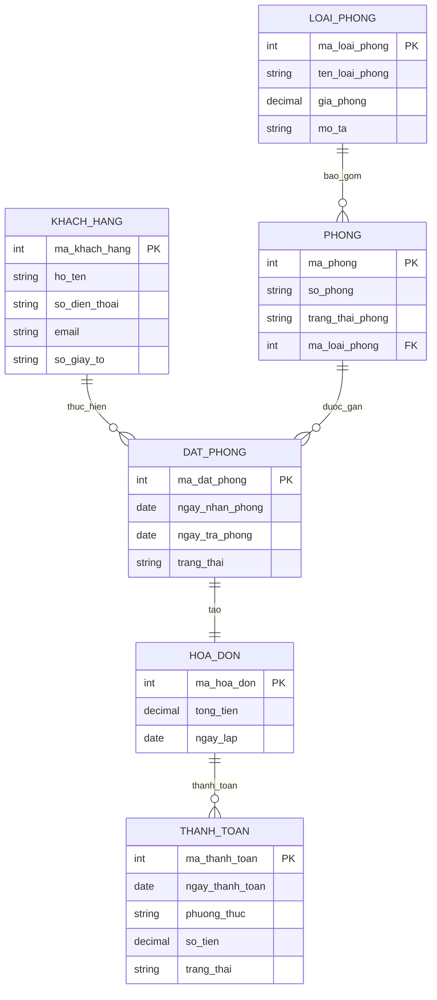

```mermaid
erDiagram
    KHACH_HANG ||--o{ DAT_PHONG : thuc_hien
    LOAI_PHONG ||--o{ PHONG : bao_gom
    PHONG ||--o{ DAT_PHONG : duoc_gan
    DAT_PHONG ||--|| HOA_DON : tao
    HOA_DON ||--o{ THANH_TOAN : thanh_toan

    KHACH_HANG {
        int ma_khach_hang PK
        string ho_ten
        string so_dien_thoai
        string email
        string so_giay_to
    }

    LOAI_PHONG {
        int ma_loai_phong PK
        string ten_loai_phong
        decimal gia_phong
        string mo_ta
    }

    PHONG {
        int ma_phong PK
        string so_phong
        string trang_thai_phong
        int ma_loai_phong FK
    }

    DAT_PHONG {
        int ma_dat_phong PK
        date ngay_nhan_phong
        date ngay_tra_phong
        string trang_thai
    }

    HOA_DON {
        int ma_hoa_don PK
        decimal tong_tien
        date ngay_lap
    }

    THANH_TOAN {
        int ma_thanh_toan PK
        date ngay_thanh_toan
        string phuong_thuc
        decimal so_tien
        string trang_thai
    }
```
